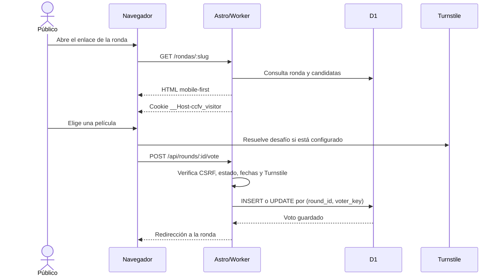
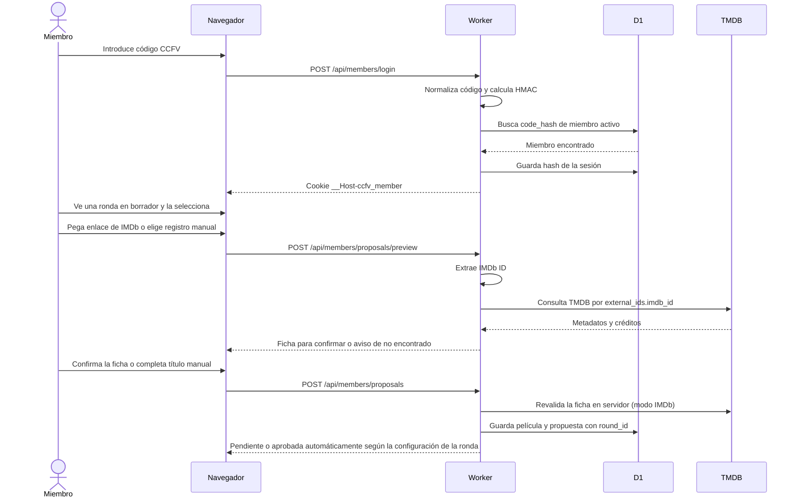
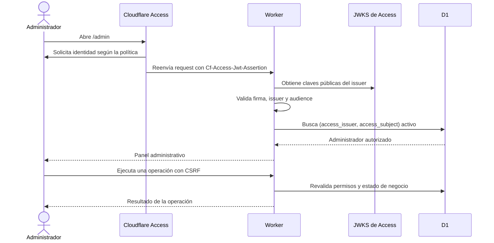
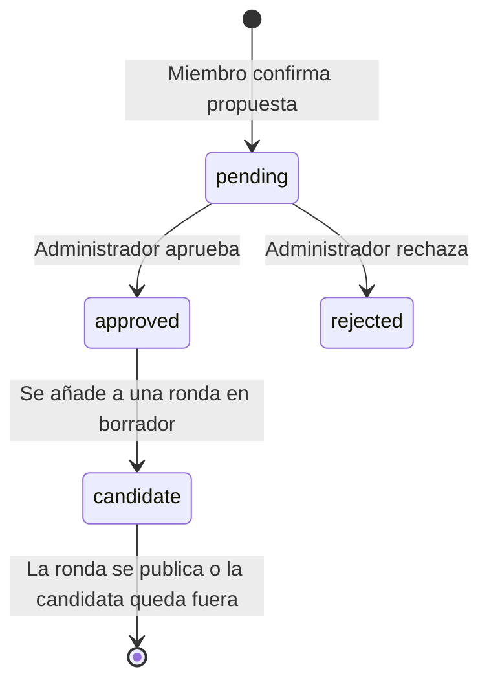
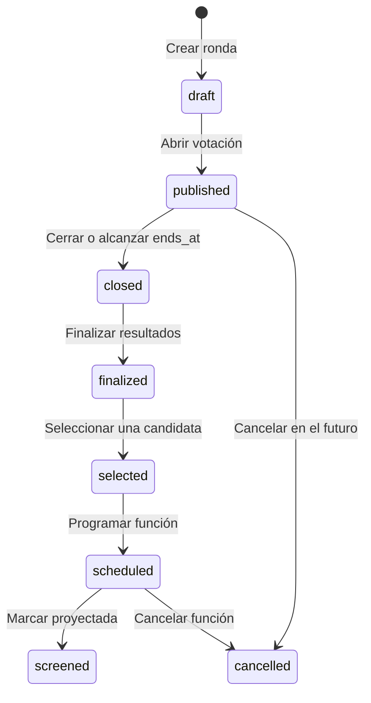
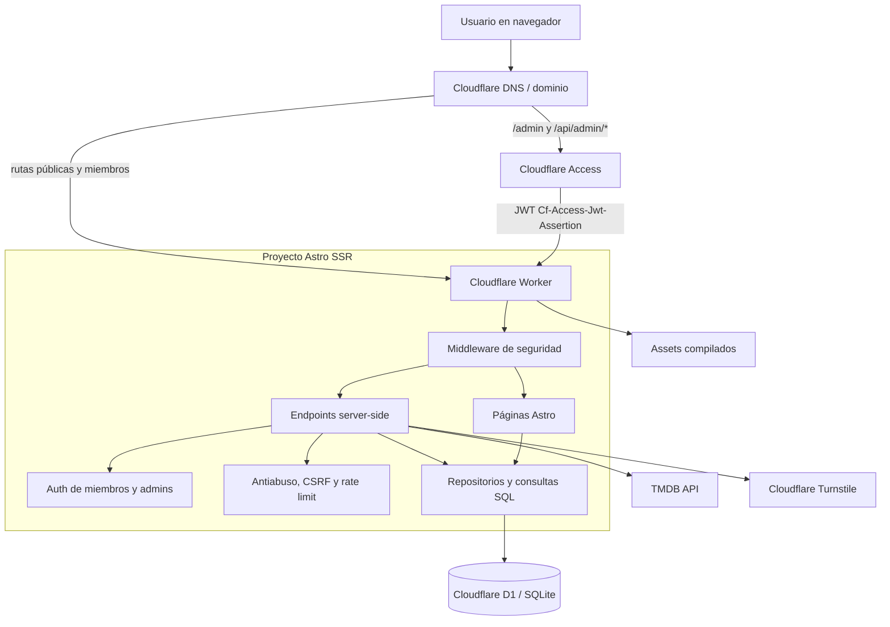
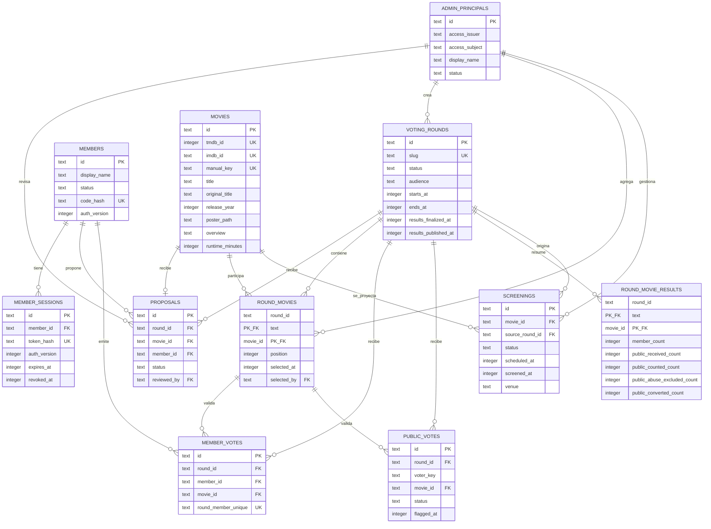
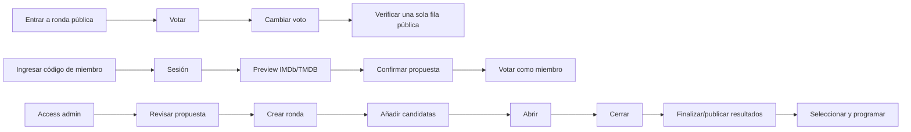
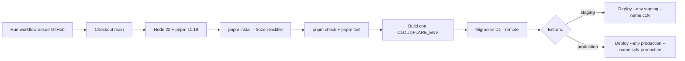

# CCFV — Arquitectura, funcionalidades y operación

Este documento describe la implementación actual de la aplicación del **Cine Club Federico Villarreal (CCFV)**. Está pensado como referencia para desarrollo, revisión, operación y despliegue. La aplicación se mantiene como un único proyecto full-stack Astro: las páginas, los endpoints, la autenticación, las consultas a D1 y la integración con TMDB viven en el mismo repositorio.

## 1. Qué problema resuelve

CCFV permite que el club:

- reciba propuestas de películas de sus miembros;
- revise y apruebe propuestas antes de convertirlas en candidatas;
- organice rondas temáticas de votación;
- reciba una señal de los miembros y otra del público general;
- cambie una elección mientras la ronda está abierta;
- cierre, finalice y publique resultados;
- seleccione, programe y marque como proyectada la película elegida.

El producto no intenta ser una red social, un catálogo personal ni un clon de Letterboxd. No hay perfiles sociales, seguidores, comentarios generales, estrellas personales, gamificación ni recomendaciones algorítmicas.

## 2. Estado actual y alcance

### Funcionalidades implementadas

- Renderizado SSR de Astro sobre Cloudflare Workers.
- D1/SQLite como base de datos y migraciones SQL versionadas.
- Drizzle ORM para el esquema y tipos de base de datos.
- Interfaz mobile-first en Astro y Tailwind CSS.
- Inicio con rondas públicas disponibles.
- Vista de una ronda con candidatas y estado de la votación.
- Votación pública por navegador, sin cuenta.
- Votación de miembros mediante código personal.
- Cambio de voto sin crear una segunda participación.
- Propuestas de miembros a partir de enlaces de IMDb.
- Extracción del IMDb ID y consulta de TMDB, sin scraping de IMDb.
- Revisión administrativa de propuestas.
- Creación, publicación, cierre y finalización de rondas.
- Resultados separados para miembros y público.
- Selección de una película y programación de una función.
- Registro de función programada, proyectada o cancelada.
- Creación, desactivación y regeneración de códigos de miembros.
- Allowlist de administradores basada en Cloudflare Access.
- CSRF, cookies seguras, cabeceras de seguridad y límites de tamaño.
- Rate limiting básico respaldado por D1.
- Turnstile adaptativo para votos públicos cuando se configura.
- Eventos de auditoría y señales antiabuso con datos minimizados.

### Pendientes operativos antes de abrir producción

El código soporta estos elementos, pero cada entorno debe configurarse por separado:

1. Crear y verificar los secretos de los Workers.
2. Configurar Turnstile real para el dominio de producción.
3. Configurar una aplicación y políticas de Cloudflare Access para producción.
4. Registrar al primer administrador de producción en `admin_principals`.
5. Ejecutar las migraciones remotas de producción.
6. Crear una ronda real y comprobar el flujo público antes de difundir el enlace.

El archivo histórico público, los flyers, reseñas, fotografías y ciclos cinematográficos quedan preparados a nivel de modelo, pero no forman parte del MVP actual.

## 3. Roles y permisos

### Público general

El público puede:

- abrir una ronda pública;
- consultar sus candidatas;
- votar sin crear cuenta;
- cambiar su voto mientras la ronda esté abierta.

El público no puede proponer películas, ver el panel administrativo ni consultar rondas exclusivas para miembros. La participación pública representa interés aproximado; no se intenta garantizar una relación criptográfica perfecta entre persona y voto.

### Miembro CCFV

El miembro entra con un código personal generado por un administrador. Después de iniciar sesión puede:

- consultar rondas disponibles para miembros;
- votar y cambiar su voto mientras la ronda está abierta;
- pegar un enlace de IMDb;
- confirmar la ficha obtenida desde TMDB;
- enviar una justificación opcional;
- consultar el estado de sus propuestas.

Un código de miembro nunca concede permisos administrativos.

### Administrador u organizador

El administrador entra mediante Cloudflare Access y una fila activa en `admin_principals`. Puede:

- revisar, aprobar o rechazar propuestas;
- crear rondas y candidatas;
- abrir y cerrar votaciones;
- finalizar y publicar resultados;
- seleccionar una película;
- programar, cancelar o marcar como proyectada una función;
- crear, desactivar y regenerar códigos de miembros;
- agregar o desactivar otros administradores;
- observar los contadores de votos públicos recibidos, contados, excluidos y convertidos.

La política de acceso de Cloudflare y la allowlist de D1 son dos controles distintos: Access autentica la cuenta y la aplicación verifica que su `issuer` y `subject` estén autorizados en la base de datos.

## 4. Flujos principales

### 4.1 Flujo público de votación



La cookie identifica el navegador de forma anónima. El servidor deriva un `voter_key` diferente para cada ronda mediante HMAC. Borrar cookies, usar incógnito o cambiar de dispositivo puede generar otra participación; esto es aceptable para la señal pública.

### 4.2 Flujo de miembro



### 4.3 Flujo administrativo



### 4.4 Ciclo de una propuesta



Por defecto una película no entra automáticamente en una votación. Cada propuesta nueva incluye `round_id`, por lo que el miembro la envía desde una ronda en borrador y el administrador decide si la propuesta aprobada se convierte en candidata. Una ronda puede activar `auto_approve_proposals`; en ese caso la propuesta queda aprobada y se añade como candidata automáticamente hasta alcanzar 12 películas. La restricción `UNIQUE (round_id, movie_id)` bloquea propuestas duplicadas dentro de una ronda. Las propuestas antiguas sin ronda se conservan como legado y solo el administrador puede ubicarlas manualmente.

### 4.5 Ciclo de una ronda y una función



`finalized`, `selected` y `scheduled` no son valores adicionales del enum de `voting_rounds`; son hitos representados por `results_finalized_at`, `round_movies.selected_at` y la tabla `screenings`. Esto evita hacer que una sola columna describa demasiadas cosas distintas.

## 5. Decisiones de UX

- La página pública no pide login.
- El camino principal está pensado para Instagram: enlace → ronda → candidata → voto.
- La interfaz es mobile-first y evita pasos innecesarios.
- El voto actual se marca al volver a la ronda.
- El botón cambia de “Votar” a “Cambiar mi voto” cuando ya existe una elección.
- Una ronda cerrada deshabilita el formulario y el servidor también rechaza cambios.
- Los resultados muestran “Miembros” y “Público” como señales independientes.
- El formulario de propuesta permite importar desde IMDb/TMDB y exige confirmar la ficha antes de enviar ese modo. Si TMDB no encuentra el título, el miembro puede cambiar a registro manual: título, sinopsis y portada HTTPS son obligatorios; año, duración y dirección son opcionales.
- El administrador puede editar una ronda ya creada (título, slug, descripción, audiencia, fechas y aprobación automática) y corregir la ficha, justificación o estado de propuestas desde el panel.
- Los errores de servidor se convierten en mensajes comprensibles, pero las reglas importantes no dependen del navegador.
- El panel concentra las operaciones en una sola vista y no intenta convertirse en un CMS.

## 6. Arquitectura técnica



### Capas del proyecto

| Capa | Ubicación | Responsabilidad |
|---|---|---|
| Páginas | `src/pages` | Renderizar inicio, rondas, miembros y administración. |
| Componentes | `src/components` | Tarjetas de películas y rondas reutilizables. |
| Endpoints | `src/pages/api` | Recibir formularios, validar y devolver HTML, JSON o redirecciones. |
| Autenticación | `src/lib/auth` | Códigos/sesiones de miembros y JWT/allowlist de administradores. |
| Base de datos | `src/lib/db` y `drizzle/migrations` | Esquema, consultas y migraciones D1. |
| TMDB | `src/lib/tmdb.ts` | Parsear IMDb ID y obtener metadatos sin scraping. |
| Antiabuso | `src/lib/antiabuse` | Cookie anónima, HMAC, rate limiting y Turnstile. |
| Seguridad | `src/lib/security` y `src/middleware.ts` | Cookies, criptografía, CSRF, cabeceras y límites de request. |
| Estilos | `src/styles`, Tailwind | Diseño visual mobile-first. |

### Rutas principales

| Ruta | Acceso | Función |
|---|---|---|
| `/` | Público | Lista rondas públicas abiertas o cerradas. |
| `/rondas/:slug` | Público o miembro | Candidatas, voto y resultados publicados. |
| `/miembros/ingresar` | Público | Inicio de sesión con código personal. |
| `/miembros` | Miembro | Rondas disponibles y acciones del miembro. |
| `/miembros/proponer` | Miembro | Consulta IMDb/TMDB y envío de propuesta. |
| `/miembros/propuestas` | Miembro | Estado de propuestas propias. |
| `/admin` | Admin | Operación completa del club. |
| `/admin/login` | Solo local | Inicio administrativo de desarrollo; no sustituye Access. |
| `/api/rounds/:id/vote` | Público/miembro | Crear o actualizar voto. |
| `/api/members/*` | Miembro | Login, logout, preview y propuestas. |
| `/api/admin/*` | Admin | Todas las operaciones del panel. |

## 7. Modelo de datos



### Restricciones relevantes

- `members.code_hash` es único: dos miembros no pueden compartir código.
- `member_sessions.token_hash` es único: la base no guarda el token en texto plano.
- `movies.tmdb_id` y `movies.imdb_id` son únicos cuando existen; las películas manuales pueden tener ambos valores nulos.
- `movies.manual_key` es único para manuales (título normalizado + año), evitando duplicados accidentales.
- `proposals (round_id, movie_id)` es único: una película no se duplica dentro de una ronda. `round_id` es nullable únicamente para conservar propuestas antiguas.
- `voting_rounds.slug` es único: cada URL de ronda es estable.
- `round_movies (round_id, movie_id)` es clave primaria: una candidata no se agrega dos veces a una ronda.
- `round_movies` tiene un índice único parcial por ronda para que solo haya una película seleccionada.
- `member_votes (round_id, member_id)` es único: un miembro tiene como máximo un voto por ronda.
- `public_votes (round_id, voter_key)` es único: un navegador tiene como máximo una fila por ronda.
- Las claves foráneas de los votos apuntan a una candidata que realmente pertenece a la ronda.
- Las fechas de ronda exigen `ends_at > starts_at`.

### Datos que no se almacenan

- Código personal de miembro en texto plano.
- Token de sesión de miembro en texto plano.
- JWT completo de Cloudflare Access.
- Contraseña de administrador.
- IP pública original: solo se almacena un HMAC temporal como señal antiabuso.
- Fingerprint invasivo del navegador.
- Token privado de TMDB o secreto privado de Turnstile en el repositorio.

## 8. Autenticación y sesiones

### Miembros

1. El administrador crea un miembro desde el panel.
2. El servidor genera un código `CCFV-...` aleatorio.
3. Solo se muestra el código una vez en la respuesta administrativa.
4. El servidor guarda `HMAC(MEMBER_CODE_HMAC_KEY, código_normalizado)`.
5. En el login se normalizan mayúsculas, guiones y espacios; se calcula el mismo HMAC y se compara contra D1.
6. Al acertar se genera un token aleatorio de 32 bytes.
7. D1 guarda `SHA-256(token)` en `member_sessions`.
8. El navegador recibe `__Host-ccfv_member` con `HttpOnly`, `Secure`, `SameSite=Lax` y `Path=/`.

La sesión dura como máximo 30 días y tiene una ventana de inactividad de 14 días. Desactivar el miembro o regenerar su código revoca sus sesiones y aumenta `auth_version`.

### Administradores

En local, `APP_ENV=local` permite usar `LOCAL_ADMIN_SECRET` para crear una cookie administrativa temporal o la cabecera de prueba `X-CCFV-Local-Admin`. Ese mecanismo no se habilita en staging ni producción.

En entornos remotos:

1. Cloudflare Access protege `/admin*` y `/api/admin*`.
2. Access autentica al usuario según su política, por ejemplo una allowlist de correo.
3. El Worker recibe `Cf-Access-Jwt-Assertion`.
4. `jose` valida firma mediante las claves públicas del issuer, `iss` y `aud`.
5. El `sub` del JWT se busca junto con `CF_ACCESS_ISSUER` en `admin_principals`.
6. Solo una fila con `status = 'active'` obtiene acceso.

El primer administrador se registra de forma operativa en D1 después de obtener el `user_uuid` desde el endpoint de identidad de Access. Los administradores posteriores se pueden agregar desde el panel con su issuer y subject.

## 9. Sistema de votación

### Decisión del MVP

El MVP usa una sola elección por persona y ronda. Cambiar la película ejecuta un `UPDATE` sobre la misma fila. Esta alternativa es más fácil de explicar, auditar y consultar que ranking, múltiple selección o puntuaciones.

La evolución posible es:

1. voto único actual;
2. permitir `N` selecciones con una tabla de preferencias y una restricción por cantidad;
3. ranking con posiciones y método de conteo documentado;
4. ponderaciones solo si el CCFV decide una política explícita.

No se implementa una fórmula que combine miembros y público en una sola puntuación.

### Reglas de escritura

- Solo se vota si la ronda está `published`.
- La hora actual debe estar entre `starts_at` inclusive y `ends_at` exclusiva.
- La película elegida debe estar en `round_movies`.
- Una ronda de audiencia `members` exige sesión de miembro.
- Una ronda `members_and_public` permite voto público solo si `PUBLIC_VOTING_ENABLED=true`.
- Una ronda cerrada no acepta cambios, aunque el usuario conserve una página antigua abierta.
- Si un miembro que tenía voto público inicia sesión y vota como miembro, el voto público se marca `excluded` con razón `member_conversion`.

### Resultados

Antes de finalizar, los resultados son internos. El administrador ejecuta la finalización, que crea una instantánea en `round_movie_results` con:

- votos de miembros;
- votos públicos recibidos;
- votos públicos contados;
- votos públicos excluidos por abuso;
- votos públicos convertidos a miembro.

Después el administrador puede publicar resultados. La interfaz presenta ambos grupos por separado y nunca los suma en un resultado ponderado automático.

## 10. Prevención de abuso

### Identidad pública anónima

- Cookie: `__Host-ccfv_visitor`.
- Contenido: identificador aleatorio de 32 bytes y firma HMAC.
- Clave por ronda: `HMAC(VISITOR_COOKIE_HMAC_KEY, round_id + visitor_id)`.
- Restricción D1: `UNIQUE(round_id, voter_key)`.

Este diseño dificulta duplicados accidentales y automatización básica, pero no pretende derrotar a alguien que borre cookies o cambie de dispositivo.

### Rate limiting

Se usa `CF-Connecting-IP` solo como señal de límite, nunca como identidad de usuario. La IP se transforma con HMAC y el período temporal antes de guardarse en `abuse_events`.

Límites actuales:

| Operación | Límite |
|---|---:|
| Intentos de login de miembro | 20 por 60 segundos |
| Consultas de preview a TMDB | 12 por 60 segundos |
| Votos públicos | 30 por 60 segundos por señal IP/ronda |

Una petición sin IP proporcionada por la plataforma no se bloquea solamente por ese motivo.

### Turnstile

Turnstile se muestra únicamente cuando el voto es público y existe una site key. El servidor llama a `siteverify`, comprueba éxito, acción y hostname. En producción, si el voto público está habilitado pero Turnstile no está configurado, el endpoint responde `503` para evitar abrir una superficie sin protección.

### Señales y revisión

`public_votes` conserva el estado `counted` o `excluded`, la razón de exclusión y datos de revisión. `abuse_events` conserva señales mínimas con `expires_at`; no se debe convertir esta tabla en un almacén permanente de IPs.

## 11. Integración IMDb/TMDB

El usuario pega un enlace de IMDb. El servidor extrae un ID con formato `tt` seguido de dígitos. No se realiza scraping de IMDb.

La consulta se hace contra TMDB usando el ID externo. Se almacenan:

- TMDB ID;
- IMDb ID;
- título y título original;
- fecha/año;
- póster;
- sinopsis;
- duración;
- directores cuando TMDB los entrega;
- idioma de metadatos y fecha de actualización.

El preview requiere sesión de miembro y rate limit. Al enviar la propuesta el servidor vuelve a validar el IMDb ID y la ficha; el campo oculto del navegador no es una fuente de confianza.

## 12. Panel administrativo

El panel está en `/admin` y funciona como una consola operativa pequeña.

### Secciones

1. **Funciones:** lista programadas, proyectadas o canceladas.
2. **Miembros:** crear código, regenerar código, desactivar miembro.
3. **Administradores:** agregar subject de Access y desactivar a otros administradores; el usuario actual no puede desactivarse a sí mismo.
4. **Propuestas:** revisar pendientes y decidir aprobada/rechazada.
5. **Rondas:** crear borrador, añadir propuestas aprobadas, abrir, cerrar, finalizar, seleccionar película y publicar resultados.
6. **Programación:** asignar fecha, lugar y notas a la película seleccionada.

### Reglas de negocio del panel

- Una ronda se publica solo con entre 2 y 12 candidatas.
- Solo propuestas aprobadas pueden entrar a una ronda; una ronda con aprobación automática las aprueba y añade en el mismo envío del miembro.
- La selección se realiza después de finalizar resultados.
- Solo una candidata puede quedar seleccionada por ronda.
- Todas las acciones administrativas exigen sesión válida y CSRF con alcance específico.
- Las operaciones importantes se ejecutan en servidor con consultas parametrizadas.

## 13. Seguridad de aplicación

| Amenaza | Mitigación actual |
|---|---|
| Código de miembro robado | HMAC, sesión revocable, regeneración y desactivación. |
| Fuerza bruta de códigos | Rate limit de login, códigos largos y aleatorios, no se guarda el código. |
| Sesión robada | Cookie HttpOnly/Secure, token almacenado como hash, expiración absoluta/idle, revocación. |
| Votos automatizados | Cookie anónima firmada, unicidad D1, rate limit, Turnstile y revisión. |
| Spam de propuestas | Solo miembros, CSRF, rate limit TMDB, máximo de propuestas por miembro/día y duplicado único. |
| Modificación de votos | El servidor valida ronda, fechas, audiencia y candidata; D1 aplica la unicidad. |
| Abuso de endpoints | Métodos explícitos, límites de tamaño, rate limit y validación Zod/servidor. |
| CSRF | Tokens HMAC por formulario y verificación de `Origin`/`Referer`. |
| XSS | Escape de Astro y creación de texto con `textContent` en scripts. |
| SQL injection | Consultas preparadas con bindings; no concatenar datos de usuario. |
| Exposición de TMDB | `TMDB_API_TOKEN` solo como secreto del Worker. |
| Privilegios admin | Access + JWT validado + allowlist activa en D1. |
| Duplicación de películas | `UNIQUE(tmdb_id)`, `UNIQUE(imdb_id)` y `UNIQUE(proposals.movie_id)`. |
| Manipulación desde cliente | Toda regla se repite en endpoints y repositorios server-side. |

El middleware añade `X-Content-Type-Options`, `Referrer-Policy`, `X-Frame-Options`, `Permissions-Policy`, CSP y `X-Request-ID`. Las respuestas de APIs y mutaciones llevan `Cache-Control: no-store`.

## 14. Testing y verificación

### Unit tests

- Parser y normalización de IMDb.
- HMAC, hashes y generación de identificadores.
- Reglas puras de estado y ventana temporal de una ronda.
- Derivación de `voter_key` y validación de datos.

### Integración

- D1 local con migraciones reales.
- Creación, rotación y desactivación de miembros.
- Expiración y revocación de sesiones.
- Restricciones únicas de propuestas y votos.
- Flujo de finalización y snapshots de resultados.
- Verificación de Turnstile con respuestas simuladas.

### Auth y permisos

- Código válido, inválido, desactivado y regenerado.
- Cookie de miembro válida, expirada, revocada y con `auth_version` antigua.
- JWT de Access con issuer, audience, firma o subject incorrectos.
- Administrador activo, desactivado y ausente de allowlist.
- Acceso local solo cuando `APP_ENV=local`.

### Endpoints y abuso

- CSRF ausente, expirado, de otro scope y con Origin incorrecto.
- Método HTTP incorrecto.
- Cuerpo demasiado grande.
- Rate limit alcanzado.
- IMDb inválido o TMDB sin resultados.
- Voto a película fuera de la ronda.
- Voto antes de `starts_at` o después de `ends_at`.
- Cambio de voto después de cerrar.
- Voto público sin Turnstile en producción.

### E2E críticos



El repositorio contiene `tests/manual-e2e.md` con un recorrido manual ya realizado sobre D1 local. Ese recorrido no sustituye pruebas automatizadas de concurrencia, Access remoto ni Turnstile real.

## 15. Observabilidad

El MVP no necesita una plataforma externa de observabilidad. Conviene conservar:

- `X-Request-ID` en cada respuesta;
- tipo de evento administrativo, entidad y actor sin contenido sensible;
- cambios de estado de propuestas, rondas, selección y screenings;
- rechazos por CSRF, rate limit, Turnstile y permisos;
- latencia y fallos de TMDB sin incluir el token;
- conteos de votos recibidos/contados/excluidos.

No registrar códigos de miembros, tokens, JWT, cookies, IP en claro, justificaciones completas en logs ni respuestas completas de proveedores externos.

## 16. Staging y producción

### Diferencias actuales

| Aspecto | Staging | Producción |
|---|---|---|
| Dominio | `staging.ccfv.denil.org` | `ccfv.denil.org` |
| Entorno Astro | `staging` | `production` |
| Worker conectado al dominio | `ccfv` | `ccfv-production` |
| Nombre lógico en `wrangler.jsonc` | `ccfv-staging` | `ccfv-production` |
| D1 | `ccfv-staging` | `ccfv-production` |
| Votación pública | Deshabilitada (`false`) | Habilitada (`true`) |
| Access issuer/audience | Configurados para staging | Deben configurarse antes del admin remoto |
| Turnstile | Site key pendiente si no se prueba | Obligatorio para voto público cuando se habilite |
| Uso | Pruebas de migraciones, Access y panel | Datos definitivos y enlaces públicos |

### Por qué el Worker de staging se llama `ccfv`

El dominio `staging.ccfv.denil.org` ya está conectado en Cloudflare al Worker existente `ccfv`. Por eso el workflow hace dos cosas distintas:

1. compila y selecciona el entorno lógico `staging`;
2. despliega el resultado al nombre físico `ccfv` con `--name ccfv`.

No cambiar ese nombre sin actualizar la ruta o el dominio en Cloudflare. Producción sí usa `ccfv-production` directamente.

### Variables públicas y secretos

En `wrangler.jsonc` pueden aparecer valores de configuración no sensibles:

- `APP_ENV`;
- `PUBLIC_APP_ORIGIN`;
- `PUBLIC_VOTING_ENABLED`;
- `PUBLIC_TIME_ZONE`;
- `PUBLIC_TURNSTILE_SITE_KEY`;
- `CF_ACCESS_ISSUER` y `CF_ACCESS_AUDIENCE`.

Los valores privados deben vivir en secretos de Cloudflare Workers:

- `TMDB_API_TOKEN`;
- `TURNSTILE_SECRET_KEY`;
- `MEMBER_CODE_HMAC_KEY`;
- `VISITOR_COOKIE_HMAC_KEY`;
- `CSRF_HMAC_KEY`;
- `LOCAL_ADMIN_SECRET` solo local.

La site key de Turnstile también se inyecta desde la variable del entorno de GitHub `TURNSTILE_SITE_KEY` durante el deploy.

### Desarrollo local

1. Copiar `.dev.vars.example` a `.dev.vars`.
2. Reemplazar los valores de prueba; nunca subir `.dev.vars`.
3. Ejecutar `pnpm db:migrate:local`.
4. Opcionalmente ejecutar `pnpm db:seed:local -- "Bianca" "CCFV-TESTLOCAL20260000000000000"`.
5. Ejecutar `pnpm dev`.

La D1 local se crea bajo `.wrangler/`. No hace falta un `database_id` remoto para desarrollar. El acceso administrativo local usa `LOCAL_ADMIN_SECRET`; no se debe copiar esa ruta de login a staging o producción.

### Migraciones remotas

Las migraciones remotas requieren `--remote` y el entorno correcto:

```text
pnpm db:migrate:staging
pnpm db:migrate:production
```

No ejecutar una migración de staging contra producción. Antes de cada migración se debe comprobar el nombre de la base y el `database_id` en `wrangler.jsonc`.

### Secretos de los Workers

Los secretos se cargan por Worker físico, no en el repositorio:

```text
pnpm exec wrangler secret put TMDB_API_TOKEN --name ccfv
pnpm exec wrangler secret put TURNSTILE_SECRET_KEY --name ccfv
pnpm exec wrangler secret put MEMBER_CODE_HMAC_KEY --name ccfv
pnpm exec wrangler secret put VISITOR_COOKIE_HMAC_KEY --name ccfv
pnpm exec wrangler secret put CSRF_HMAC_KEY --name ccfv
```

Para producción se repiten los comandos usando `--name ccfv-production`. Los valores nunca deben aparecer en `wrangler.jsonc`, GitHub logs, capturas públicas o commits.

### Despliegue desde GitHub

El workflow `.github/workflows/deploy.yml` es manual (`workflow_dispatch`) y recibe `staging` o `production`.



El entorno de GitHub correspondiente debe tener:

- secreto `CLOUDFLARE_API_TOKEN`;
- secreto `CLOUDFLARE_ACCOUNT_ID`;
- variable `TURNSTILE_SITE_KEY`.

El API token debe tener únicamente permisos necesarios para Workers, D1 y despliegue del recurso. Los secretos de GitHub sirven para que el runner publique; los secretos del Worker sirven para que la aplicación funcione en runtime. Son almacenes distintos.

## 17. Roadmap por MVP

### MVP 0 — Infraestructura y base técnica

**Objetivo:** poder levantar la aplicación y probar reglas de negocio sin datos reales.

**Funcionalidades:**

- proyecto Astro SSR;
- adapter Cloudflare y configuración Wrangler;
- D1 local y migración inicial;
- esquema de entidades y restricciones;
- middleware de seguridad;
- secretos locales y seed de prueba;
- unit tests básicos.

**Tareas:**

- instalar dependencias con pnpm;
- revisar `.dev.vars`;
- ejecutar migración y seed local;
- verificar `pnpm check`, `pnpm test` y `pnpm build`;
- documentar cualquier cambio de esquema como migración nueva.

**Dependencias:** Node 22+, pnpm, Wrangler y un entorno local funcional.

**Criterios de aceptación:** la app arranca localmente, una D1 local se migra, el seed crea un miembro, el login local funciona y los tests pasan.

### MVP 1 — Primera versión utilizable internamente

**Objetivo:** que el equipo CCFV organice propuestas y rondas en un entorno controlado.

**Funcionalidades:**

- códigos de miembros y sesiones;
- preview de IMDb/TMDB;
- propuestas pendientes y revisión;
- rondas solo para miembros o mixtas;
- votos de miembros con cambio;
- panel de administración;
- Access en staging;
- resultados separados;
- selección y programación de función.

**Tareas:**

- crear D1 staging y ejecutar migraciones remotas;
- crear el primer administrador de staging;
- configurar Access para `/admin*` y `/api/admin*`;
- cargar secretos del Worker staging;
- probar el flujo E2E interno;
- verificar rotación y desactivación de miembros.

**Dependencias:** cuenta Cloudflare, dominio, Access, D1 staging y TMDB token.

**Criterios de aceptación:** un organizador puede recorrer propuesta → aprobación → ronda → voto → cierre → resultados → selección → función sin tocar SQL manualmente después del bootstrap inicial.

### MVP 2 — Primera versión pública

**Objetivo:** abrir una ronda pública real con riesgo operativo controlado.

**Funcionalidades:**

- producción separada de staging;
- dominio público;
- votación pública habilitada;
- Turnstile configurado;
- rate limiting y revisión antiabuso;
- Access de producción;
- backups y procedimiento de migración;
- publicación de resultados elegida por el equipo.

**Tareas:**

- crear/configurar aplicación Access de producción;
- cargar `CF_ACCESS_ISSUER` y `CF_ACCESS_AUDIENCE` de producción;
- registrar el primer admin de producción;
- crear D1 y aplicar migración remota;
- cargar todos los secretos en `ccfv-production`;
- configurar Turnstile para `ccfv.denil.org`;
- ejecutar smoke test público y administrativo;
- crear la primera ronda con fechas reales.

**Dependencias:** producción de Cloudflare, dominio, credenciales TMDB, Turnstile y política de acceso aprobada.

**Criterios de aceptación:** un visitante puede votar y cambiar voto, un miembro puede entrar y proponer, un admin puede operar la ronda y una ronda cerrada rechaza mutaciones antiguas.

## 18. Criterios de aceptación globales

- Una propuesta no entra automáticamente en una ronda.
- Una película duplicada no crea otra propuesta.
- Un código de miembro no aparece en D1 en claro.
- Regenerar un código invalida sesiones anteriores.
- Desactivar un miembro invalida sus sesiones.
- Un miembro solo tiene una fila de voto por ronda.
- Un navegador solo tiene una fila de voto público por ronda mientras conserve su identidad anónima.
- Cambiar el voto actualiza el registro, no incrementa artificialmente el total.
- Un voto no puede escribirse fuera de las fechas o estado de la ronda.
- Los votos de miembros y público se cuentan por separado.
- La selección de película es única por ronda.
- Un endpoint administrativo sin JWT/allowlist/CSRF válido falla.
- Los secretos no se imprimen en logs ni se versionan.
- Las migraciones staging y producción apuntan a bases distintas.
- El workflow falla antes de desplegar si check o tests fallan.

## 19. Decisiones abiertas

### Una elección o varias selecciones

- **Actual:** una película por persona y ronda.
- **Alternativa:** permitir elegir N películas.
- **Recomendación:** mantener una elección en el MVP; solo cambiar después de observar una necesidad real.

### Resultados durante o después de votar

- **Actual:** resultados ocultos hasta que el admin finaliza y publica.
- **Alternativa:** mostrar un contador en vivo.
- **Recomendación:** mantenerlos ocultos para evitar sesgo y presión social durante la ronda.

### Anonimato de propuestas

- **Actual:** el panel muestra el miembro que propuso la película.
- **Alternativa:** ocultar identidad y mostrarla solo en auditoría.
- **Recomendación:** discutirlo con el CCFV; la transparencia ayuda a coordinar, pero el anonimato puede reducir presión social.

### Recuperación de códigos

- **Actual:** un administrador regenera el código; el código anterior deja de funcionar.
- **Alternativa:** flujo de recuperación con otra identidad.
- **Recomendación:** no añadir email/contraseña mientras el club pueda operar la regeneración manual.

### Política de votos sospechosos

- **Actual:** se cuentan, se pueden excluir y se registran señales minimizadas.
- **Alternativa:** bloquear automáticamente por IP o fingerprint.
- **Recomendación:** mantener señales suaves, Turnstile y revisión; no usar IP como identidad ni fingerprint invasivo.

### Duración de sesiones

- **Actual:** miembro 30 días absolutos y 14 días de inactividad; Access administra la sesión de admin.
- **Alternativa:** sesiones más cortas o revocación central.
- **Recomendación:** conservar la experiencia simple para miembros y revisar la duración de Access según la política del equipo.

### Duplicados de propuestas

- **Actual:** una película duplicada devuelve un estado de duplicado y no suma una propuesta nueva.
- **Alternativa:** acumular apoyos sobre la propuesta existente.
- **Recomendación:** mantener el bloqueo hasta definir si el apoyo comunitario debe ser una señal independiente.

### Access para producción

- **Actual:** staging está configurado; producción debe tener su propio issuer, audience, aplicación y políticas.
- **Alternativa:** reutilizar la aplicación de staging.
- **Recomendación:** usar una aplicación separada para que una prueba no abra accidentalmente el panel de producción.

## 20. Mejoras futuras

- Sección pública **Archivo CCFV** basada en `screenings` y metadatos editoriales.
- Flyer, artículo, reseña, fotografías y ciclo cinematográfico vinculados a cada proyección.
- Exportación CSV de resultados y propuestas.
- Backups y restauración documentados para D1.
- Limpieza programada de `abuse_events` expirados.
- Métricas de latencia y errores con un proveedor externo si el tráfico lo justifica.
- Turnstile adaptativo por patrones sospechosos en vez de exigirlo a todo el público.
- Ranking o multi-selección solo con una política de conteo aprobada.
- Separación de roles administrativos si el club necesita moderadores con permisos limitados.
- Previsualización y edición de flyers desde una herramienta editorial pequeña, no un CMS general.

## 21. Comandos de referencia

```text
# Desarrollo
pnpm install
pnpm db:migrate:local
pnpm db:seed:local -- "Bianca" "CCFV-TESTLOCAL20260000000000000"
pnpm dev

# Verificación
pnpm check
pnpm test
pnpm build

# Migraciones remotas
pnpm db:migrate:staging
pnpm db:migrate:production

# Secretos del Worker staging
pnpm exec wrangler secret put TMDB_API_TOKEN --name ccfv

# Secretos del Worker production
pnpm exec wrangler secret put TMDB_API_TOKEN --name ccfv-production
```

Para publicar se debe usar el workflow de GitHub y elegir explícitamente `staging` o `production`. No ejecutar comandos de producción con el nombre de la base o del Worker de staging.
